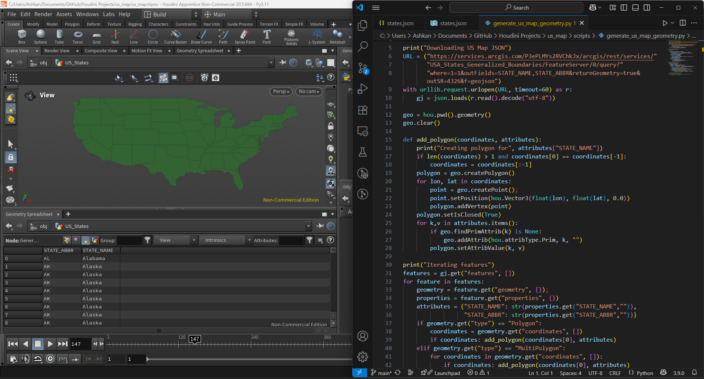

A Houdini project that generates a map of the US using ArcGIS data.

County map colored with economic data

Expanded with sliders to select the source and year of the data and to display county lines in the output render

State map work-in-progress
